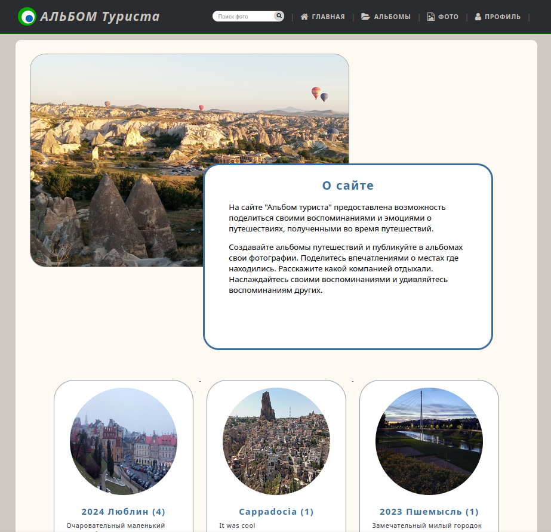
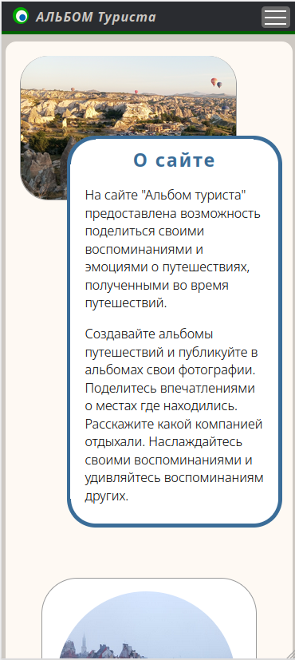
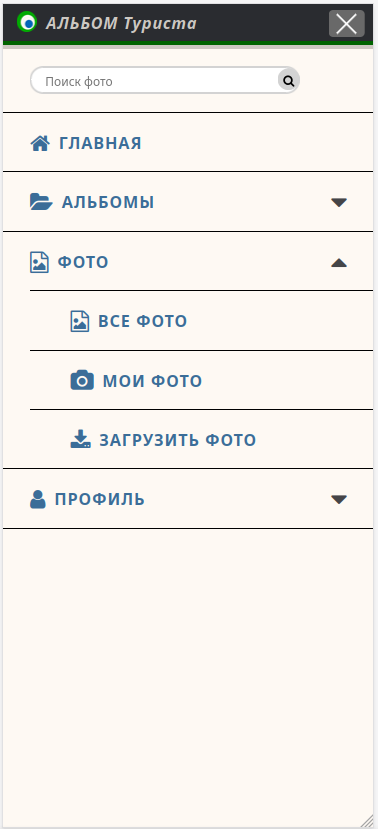
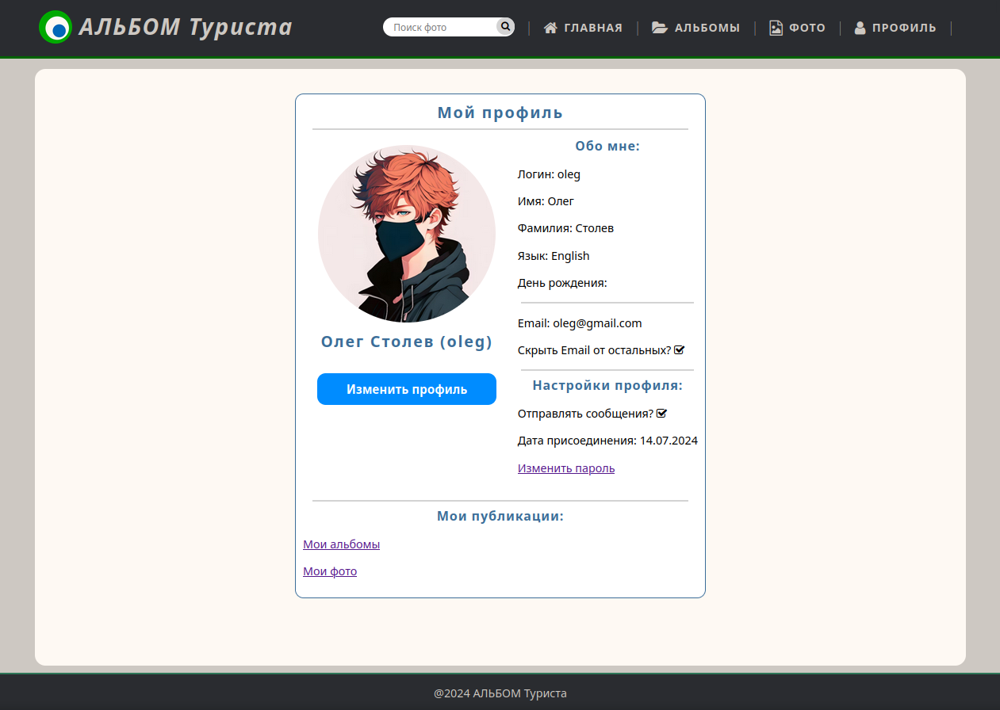
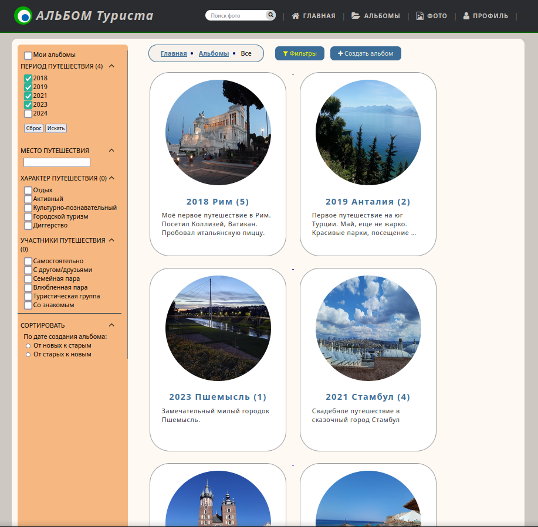
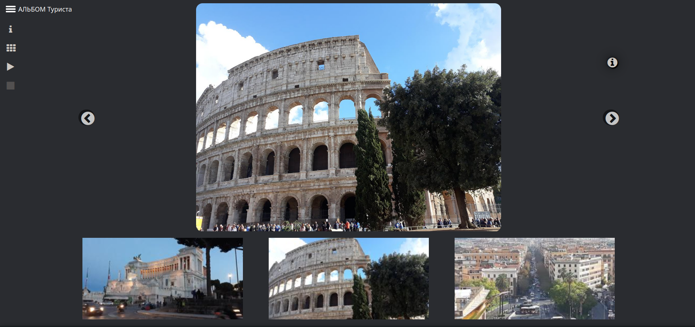

#  АЛЬБОМ Туриста

## Оглавление
1. [Краткое описание](#Краткое-описание)
2. [Функционал](#Функционал)
3. [Инструменты](#Инструменты)
4. [Планы развития](#Планы-развития)

## Краткое описание

**World Snap** – это платформа для путешественников, где можно поделиться своими воспоминаниями и эмоциями. Любители путешествий могут создавать альбомы, публиковать фотографии и рассказывать о местах, где они побывали, а также делиться впечатлениями о своих поездках.

Посетители сайта могут свободно просматривать фотоальбомы, но для публикации фотографий и создания альбомов требуется регистрация.

## Функционал

На главной странице представлена единая структура как для зарегистрированных пользователей, так и для гостей. Здесь можно найти краткое описание сайта, а также ознакомиться с последними добавленными альбомами, которые позволяют погрузиться в новые впечатления и истории путешествий.

Сайт (проект) состоит из 2-х приложений:
1. account - функционал управления аккаунтами пользователей
2. album - функционал управления созданными альбомами и публикуемыми фотографиями

### Приложение account

Приложение позволяет:
* Зарегистрироваться с подтверждением через почту;
* Выполнить авторизованный вход и выход из системы;
* Восстановить пароль;
* В личном кабинете: 
    + просмотреть и изменить свой профиль;
    + сменить аватар;
    + изменить пароль.

### Приложение album

Приложение позволяет:
* Выполнять действия с альбомами:
    + просмотривать список альбомов с возможностью фильтрации;
    + просмотривать информацию об альбоме;
    + создавать альбом;
    + изменять свойств альбома;
* Выполнять действия с фотографиями:
    + Просматривать фотографии:
        - в галерее;
        - в выбранном альбоме;
        - общим списком;
    + Искать фотографии;
    + Публиковать фото в привязке к альбому;
    + Редактировать свойства фотографии.

## Инструменты
1. **Python** (3.12);
2. **Django** (Wev Framework);
3. **PostgreSQL** (database), psycopg (адаптер базы данных PostgreSQL для Python);
4. Библиотека Django: **Pillow** для работы с изображениями;
5. Библиотека **Slick slider** (скачано) - слайдер, используется для галереи изображений;
6. Библтоьека python-slugify для преобразования строк в формат, пригодный для использования в URL (слаг).

## Планы развития

1. Добавить капчу при регистрации нового пользователя;
2. Изменение пароля;
3. Удаление профиля;
4. Пагинацию при просмотре фотографий
5. Удаление фотографии;
6. Оценка фотографии посетителями;
7. Настройки приватности альбомов (публичный/приватный);
8. Мультиязычность.
